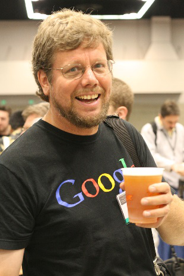

# 1.Python简介

### **1.计算机**

#### **1.1计算机概念**

**计算机**【computer】俗称电脑，是现代一种用于高速计算的电子机器。

#### **1.2计算机组成**

计算机由**硬件系统**与**软件系统**组成。

计算机硬件系统包含：

1. **运算器**：用于进行计算的计算机硬件，包含在CPU内

2. **控制器**：用于控制计算机各部件工作，包含在CPU内

3. **存储器**：用于存储计算机运行过程中的数据

​	    a. *内存储器*：常见内存储器有内存等……

​        b.  *外存储器*：常见外存储器有硬盘、移动硬盘、U盘等……

4. **输入设备**：用于向计算机发出指令，常见输入设备有键盘、鼠标、扫描仪、扫描枪、触摸板、手写板等……

5. **输出设备**：用于展示计算机运行结果，常见输出设备有显示器、投影仪、打印机等……

计算机软件系统包含：

1. **系统软件**：与计算机硬件打交道，保障计算机硬件正常工作。

2. **操作系统软件**：建立计算机与人之间的交流平台，使人可以控制计算机进行工作。例如：windows、Linux、Unix等……

3. **应用软件**：满足用户特定需求的功能程序。例如：QQ、WORD、飞秋等……

### **2. Python语言**

#### **2.1 编程语言**

​	**语言**是人类最重要的交际工具，是人类之间进行信息交换的主要表达方式。

​	**编程语言**是用来定义计算机程序的语言，用来向计算机发出指令。

#### **2.2 Python语言**

​	**Python语言**是一种面向对象的解释型计算机程序设计语言。

Python语言创始人为吉多·范罗苏姆（Guido van Rossum）

### **3. Python语言特点**

#### **3.1优点**

**简单：**

Python是一种代表简单主义思想的语言。阅读一个良好的Python程序就感觉像是在读英语一样，尽管这个英语的要求非常严格！Python的这种伪代码本质是它最大的优点之一。它使你能够专注于解决问题而不是去搞明白语言本身。

**易学:**

就如同你即将看到的一样，Python极其容易上手。

**免费、开源：**

Python是FLOSS（自由/开放源码软件）之一。简单地说，你可以自由地发布这个软件的拷贝、阅读它的源代码、对它做改动、把它的一部分用于新的自由软件中。FLOSS是基于一个团体分享知识的概念。这是为什么Python如此优秀的原因之一——它是由一群希望看到一个更加优秀的Python的人创造并经常改进着的。

**高层语言：**

当你用Python语言编写程序的时候，你无需考虑诸如如何管理你的程序使用的内存一类的底层细节。

**可移植性：**

由于它的开源本质，Python已经被移植在许多平台上（经过改动使它能够工作在不同平台上）。如果你小心地避免使用依赖于系统的特性，那么你的所有Python程序无需修改就可以在下述任何平台上面运行。这些平台包括Linux、Windows、FreeBSD、Macintosh、Solaris、OS/2、Amiga、AROS、AS/400、BeOS、OS/390、z/OS、Palm OS、QNX、VMS、Psion、Acom RISC OS、VxWorks、PlayStation、Sharp Zaurus、Windows CE甚至还有PocketPC、Symbian以及Google基于linux开发的Android平台！

**解释性：**

这一点需要一些解释。一个用编译性语言比如C或C++写的程序可以从源文件（即C或C++语言）转换到一个你的计算机使用的语言（二进制代码，即0和1）。这个过程通过编译器和不同的标记、选项完成。当你运行你的程序的时候，连接/转载器软件把你的程序从硬盘复制到内存中并且运行。而Python语言写的程序不需要编译成二进制代码。你可以直接从源代码运行程序。在计算机内部，Python解释器把源代码转换成称为字节码的中间形式，然后再把它翻译成计算机使用的机器语言并运行。事实上，由于你不再需要担心如何编译程序，如何确保连接转载正确的库等等，所有这一切使得使用Python更加简单。由于你只需要把你的Python程序拷贝到另外一台计算机上，它就可以工作了，这也使得你的Python程序更加易于移植。

**面向对象：**

Python既支持面向过程的编程也支持面向对象的编程。在“面向过程”的语言中，程序是由过程或仅仅是可重用代码的函数构建起来的。在“面向对象”的语言中，程序是由数据和功能组合而成的对象构建起来的。与其他主要的语言如C++和Java相比，Python以一种非常强大又简单的方式实现面向对象编程。

**可扩展性：**

如果你需要你的一段关键代码运行得更快或者希望某些算法不公开，你可以把你的部分程序用C或C++编写，然后在你的Python程序中使用它们。

**丰富的库：**

Python标准库确实很庞大。它可以帮助你处理各种工作，包括正则表达式、文档生成、单元测试、线程、数据库、网页浏览器、CGI、FTP、电子邮件、XML、XML-RPC、HTML、WAV文件、密码系统、GUI（图形用户界面）、Tk和其他与系统有关的操作。记住，只要安装了Python，所有这些功能都是可用的。这被称作Python的“功能齐全”理念。除了标准库以外，还有许多其他高质量的库，如wxPython、Twisted和Python图像库等等。

**规范的代码：**

Python采用强制缩进的方式使得代码具有极佳的可读性。

#### **3.2缺点**

**运行速度慢：**

如果对速度有要求的话，建议使用C++改写关键部分。

**国内市场较小：**

国内以python来做主要开发的，目前只有一些web2.0公司。但时间推移，目前很多国内软件公司，尤其是游戏公司，也开始规模使用他。

**中文资料匮乏：**

托社区的福，有几本优秀的教材已经被翻译了，但入门级教材多，高级内容还是只能看英语版。

**构架选择太多：**

没有像C#这样的官方.net构架，也没有像ruby由于历史较短，构架开发的相对集中。Ruby on Rails 构架开发中小型web程序天下无敌。不过这也从另一个侧面说明，python比较优秀，吸引的人才多，项目也多。

