# 2.第一个程序

#### 1.第一个程序

##### 1.1 Hello Python书写步骤

​		步骤一：新建文本文档文件,修改名称为hello.py
​		步骤二：使用记事本打开文件，书写程序内容如下：

​		步骤三：打开命令行，输入执行指令：python hello.py

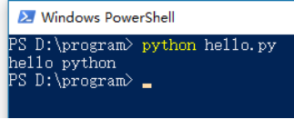

​		运行结果：屏幕显示hello python 

##### 1.2 Bug

软件的Bug，是指软件程序的漏洞或缺陷。
针对BUG具有如下能力：
	1.具备识别BUG的能力：**多看**
	2.具备分析BUG的能力：**多思考、多查阅资料**
	3.具备解决BUG的能力：**多尝试、多查阅资料、多记录/记忆**

##### 1.3 hello python常见问题

1. 错误类型：输入错误

   原因分析：将字符输入错误引发的错误

   解决方案：检查对应位置拼写内容是否正确

   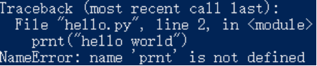

2.	错误类型：缩进错误

	原因分析：代码行前面添加了多余的空格引发的错误
	
	解决方案：检查对应位置行首是否存在多余的空格
	
	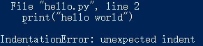

3.  错误类型：语法错误

   原因分析：代码行中是否存在非法的python语法格式

   解决方案：检查对应位置语法输入是否有误

   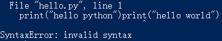

#### 2.PyCharm

##### 2.1 PyCharm介绍

​	PyCharm是一种Python IDE，带有一整套可以帮助用户在使用Python语言开发时提高其效率的工具。	

##### 2.2 PyCharm主界面

​	PyCharm包含4个主要区分，分别为菜单工具栏、项目结构区、代码区、信息显示区。

​	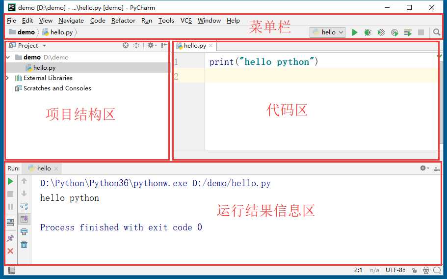

##### 2.3PyCharm项目管理

​		**创建新项目管理**

​			步骤一：启动界面中选择**【Create New Project】**

​			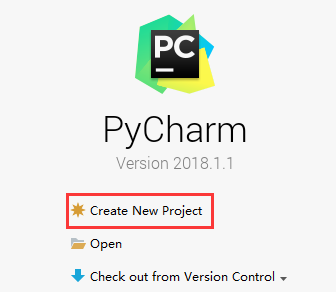

​			步骤二：new Project窗口中选择**【Pure Python】**
​			步骤三：Location路径中输入项目保存位置路径
​			步骤四：点击**【Create】**完成创建新项目工作

​			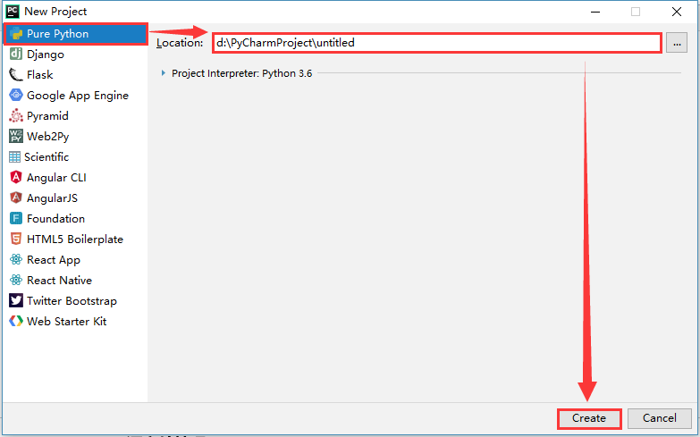

​		**同一窗口打开单个项目**

​			步骤一：主界面中选择【File】菜单中的【Open】选项

​			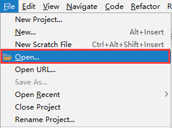

​			步骤二：Open File or Project窗口中选择要打开的项目目录，并单击【OK】按钮

​			

​			步骤三：Open Project窗口中选择【Open in current window】选项，并单击【OK】按钮

​			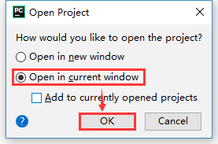

​		**同一窗口打开多个项目**

​			步骤一：主界面中选择【File】菜单中的【Open】选项

​			

​			步骤二：Open File or Project窗口中选择要打开的项目目录，并单击【OK】按钮

​			

​			步骤三：Open Project窗口中选择【Open in current window】选项，勾选【Add to currently opened Projects】选项，并单击【OK】按钮

​			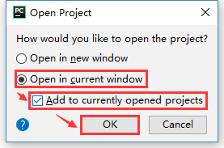

​		**不同窗口打开项目**

​			步骤一：主界面中选择【File】菜单中的【Open】选项

​			

​			步骤二：Open File or Project窗口中选择要打开的项目目录，并单击【OK】按钮

​			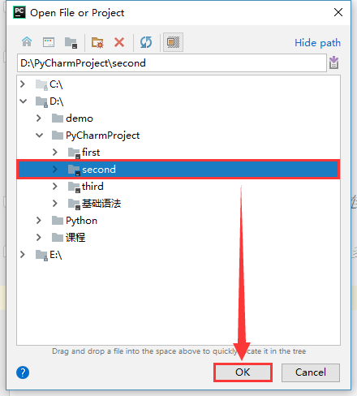

​			步骤三：Open Project窗口中选择【Open in new window】选项，并单击【OK】按钮

​			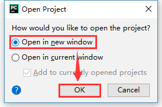

##### 2.4 PyCharm源文件管理

​		**创建新python程序源文件**
​			步骤一：项目结构区任意位置右键单击鼠标

​			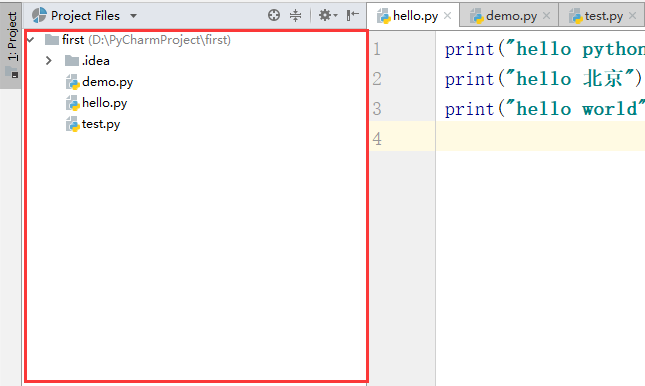

​			步骤二：弹出菜单中选择【New】选项中的【Python File】选项

​			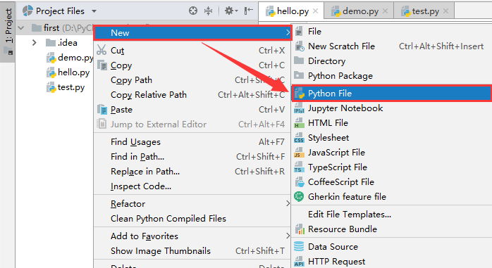

​			步骤三：New Python file窗口中输入文件名，，并单击【OK】按钮

​			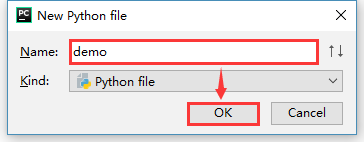

##### 2.5 PyCharm Debug调试程序

​			步骤一：在代码区要进行调试的代码行左侧单击鼠标左键，添加调试断点符号

​			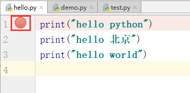

​			步骤二：右键单击源文件或代码区内部，弹出菜单，选择【Debug ***】

​			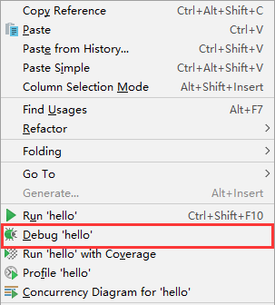

​			或在右上角工具栏区单击【debug】按钮，快捷键【shift+F9】

​			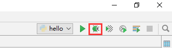

​			步骤三：在Debug窗口中单击【Step Over】键进行程序单步执行，快键键【F8】，单击左侧绿色【Resumn program】键放行程序向下执行，快捷键【F9】

​			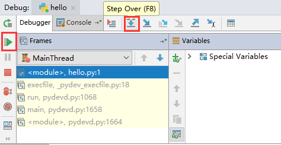

